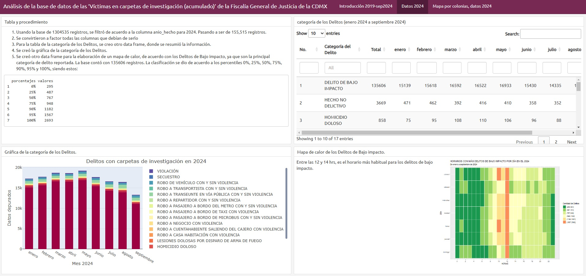
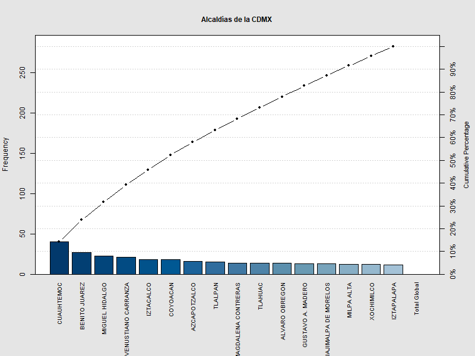
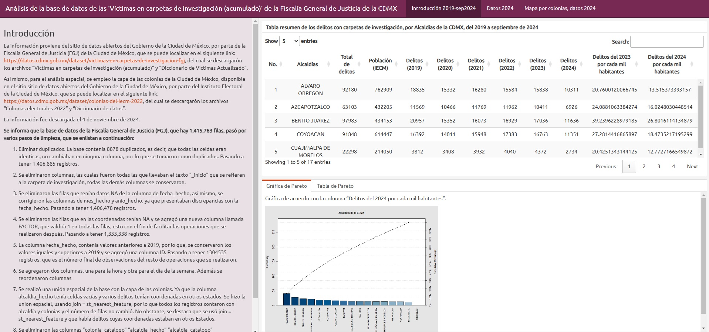
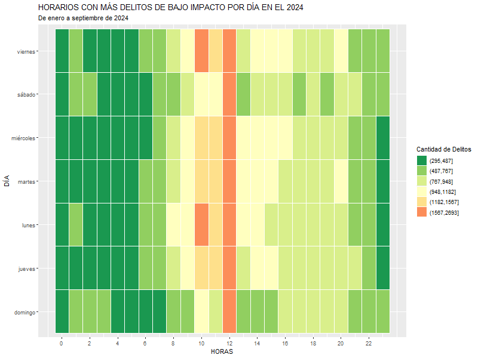
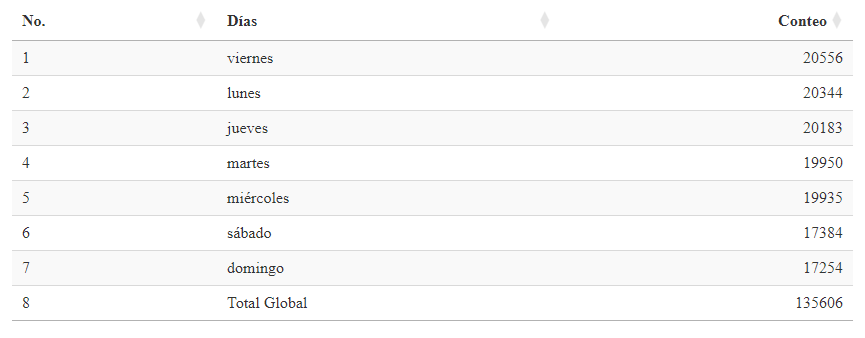
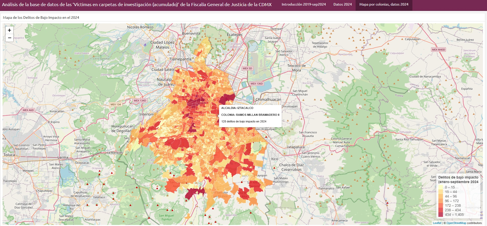

# Dashboard de la base de datos de las ‘Víctimas en carpetas de investigación (acumulado)’ de la Fiscalía General de Justicia de la CDMX

- Fecha de descarga de la información: 4 de noviembre de 2024

Datos de la Fiscalía General de Justicia de la CDMX:
- Sitio de descarga: https://datos.cdmx.gob.mx/dataset/victimas-en-carpetas-de-investigacion-fgj
- Tipo de archivo: .csv
- Archivos usados: Víctimas en carpetas de investigación (acumulado) y Diccionario de Víctimas Actualizado

Datos del Instituto Electoral de la CDMX:
- Sitio de descarga: https://datos.cdmx.gob.mx/dataset/colonias-del-iecm-2022
- Tipo de archivo: .shp
- Archivo usado: Colonias electorales 2022

## Introducción 

Los datos abiertos, son aquellos datos digitales de carácter público que son accesibles en línea y pueden ser utilizables, reutilizables y redistribuidos por cualquier interesado, sin la necesidad de contar con un permiso específico. Al respecto, el Gobierno de México, en todos sus niveles, es decir, Federal, Estatal y Municipal, pone a disposición de la ciudadanía la información que genera. Ahora bien, en lo que respecta a temas de seguridad, de acuerdo con la Fiscalía General de la República, los procedimientos penales acusatorios inician con una denuncia ante el Ministerio Público, es importante aclarar que no siempre el denunciante es el afectado, por ejemplo, casos de homicidio. Una vez que la denuncia ha sido realizada, se inicia una carpeta de investigación, en donde se le da seguimiento al caso. 

Derivado de lo anterior, los datos que son públicos de estas carpetas de investigación de la CDMX, se localizan en el portal de datos abiertos del Gobierno de la CDMX, en el link anteriormente mencionado. A fin de realizar un análisis de esta información y presentar los resultados obtenidos, se elaboró un Dashboard en Rstudio, aunque podría decirse que ese es el objetivo principal del dashboard, existe otro objetivo y es la adecuada limpieza de una base de datos, ya que el que la información se encuentre disponible, no quiere decir que no tenga errores. La información fue analizada en el software R. Se aclara que para el 2024, la base solo tiene datos hasta septiembre.

## Metodología

Se informa que la base de datos de la Fiscalía General de Justicia (FGJ) de la CDMX, al momento de la fecha de la descarga, contenía 1,415,763 filas y 22 columnas. La base de datos pasó por varios pasos de limpieza, los cuales se enlistan a continuación:

1. Se eliminaron duplicados.

Las Buenas Prácticas Estadísticas y Geográficas se basan en diversos factores, dos de ellos son la confiabilidad y la veracidad. Normalmente una base de datos contiene un identificador ID, el cual permite asumir que cada registro es único, no obstante, ese no era el caso de la base. Por lo que se procedió a analizar si había filas repetidas por completo, es decir, con la misma información en todas las columnas. Se encontró que la base tenía 8878 duplicados, los cuales fueron eliminados y la base pasó a tener 1,406,885 registros.

2. Se eliminaron columnas.

De manera genera, en lo que respecta a las fechas de las carpetas había dos categorías, siendo "_inicio" y "_hecho", la primera se refería a la fecha en la que se dió inicio a la carpeta de investigación. Por otra parte, "_hecho" se refería al delito en sí mismo, la fecha, mes y año en el que ocurrió, por lo que para fines prácticos, se decidió conservar solo las columnas correspondientes al delito, es decir, se conservó "_hecho".

3. Se eliminaron las filas que tenían datos NA de la columna de fecha_hecho.

Al realizar un análisis espacio-temporal de la información, los datos más importantes radican en el uso de información confiable, por lo que las filas que no tuvieran valores en la columna de fecha fueron eliminadas. Así mismo, se encontraron discrepancias en la información de las columnas de mes y año. En el primer caso, había meses escritos en inglés y otros en español, en el segundo caso había años mal escritos. Por lo que estos fueron automáticamente corregidos y la base pasó a tener 1,406,478 registros.

4. Se eliminaron las filas que en las coordenadas tenían NA.

La información al tener un comonente espacial, fue indispensable eliminar las filas que tenían valores vacíos en las coordenadas. Además, se creó una columna llamada FACTOR, que valdría 1 en todas las filas, esto con el fin de facilitar las operaciones que se realizaron después. La base pasó a tener 1,333,338 registros.

5. Se filtró la información, para conservar de 2019 a 2024.

Un resumen a la columna de la fecha y a la del año, permitio corroborar que había fechas de incluso 100 años atrás, por lo que para continuar con el análisis, estas fechas fueron eliminadas. Así mismo, se agregó una columna ID. La base pasó a tener 1304535 registros, **que es el número final de observaciones del resto de operaciones que se realizaron.**

6. Se agregaron dos columnas, una para la hora y otra para el día de la semana. Además se reordenaron columnas

7. Se realizó una unión espacial de la base con la capa de las colonias establecidas por el IECM.

Dentro de la base de la FGJ, la columna alcaldia_hecho tenía celdas vacías y varios delitos tenían coordenadas en otros Estados vecinos, muchos más de los que un breve resumen de la información preeliminar había aarojado. Por lo que se hizo una union espacial, usando join = st_nearest_feature, por lo que todos los registros contaron con alcaldía y colonias y el número de filas no cambió. No obstante, se destaca que se usó join = st_nearest_feature y que había delitos cuyas coordenadas estaban en otros Estados, esto implica que la captura de los datos debe de ser vigilada con mayor precisión, ya que una columna tan importante como colonia, depende de una unión geoespacial, ya que de esta columna se deriva otra más importante como lo es Alcaldía.

8. Se eliminaron las columnas “colonia_catalogo” “alcaldia_hecho” “alcaldia_catalogo” “municipio_hecho” y finalmente se obtuvo una base limpia.

9. Posteriormente, se procedió a realizar las tablas, gráficas y mapas que se presentan en los siguientes apartados del dashboard.

## Paneles del Dashboard

Para el primer apartado del Dashboard, se colocó:
- Un sidebar en donde se describió el procedimiento realizado para obtener la base final:
- Una tabla resumen por Alcaldías y año de los delitos, así como una tasa de incidencia por cada 1000 habitantes. Se destaca que para un análisis futuro, es importante diferenciar por tipo de delito para que las tasas sean más relevantes.
- Una gráfica de pareto, donde se adjuntó la frecuencia acumulada de los delitos por Alcaldía para el año 2024, encontrandosé que las Alcaldías Cuauhtémoc y Benito Juárez aportaban el 23% del total de los delitos.

- Una tabla de los datos de la gráfica de pareto, donde se muestran de manera textual lo dicho anteriormente, que las Alcaldías Cuauhtémoc y Benito Juárez aportaban el 23% del total de los delitos, seguidas de Miguel Hidalgo, Venustiano Carranza e Iztacalco. Algo que podría sonar curioso para algunos, es que Iztapalapa a pesar de tener una mala fama, fue la Alcaldía que respecto al total de su población, aportó menor cantidad de delitos registrados por cada 1000 habitantes en toda la CDMX.

En el segundo panel, se colocó:
- El procedimiento realizado a la base final para obtener los datos de solo el 2024, pasando a crearse una base de 155,515 registros. 
- Una tabla de la categoría de los Delitos, en donde se resumió la información por meses.
- Una gráfica de los delitos del 2024, agrupada por categorías y meses. Esta gráfica es la representación de la tabla anterior, mostrando que mayo del 2024 fue el mes en el que más se denunciaron delitos. Otro punto a destacar es que de todas las categorías de delitos, la más común es la de "Delito de bajo impacto".
- Un mapa de calor, de acuerdo con los Delitos de Bajo impacto, cuya base contó con 135606 registros. La clasificación de los límites se dio de acuerdo a los percentiles 0%, 25%, 50%, 75%, 90%, 95% y 100%. Se encontró, que los delitos de bajo impacto son más comúnes entre las 12 y 14 hrs, es el horario más habitual para los delitos de bajo impacto. Extra se creo una tabla resumen de los días de la semana respecto al total de delitos de bajo impacto, los viernes, lunes y jueves eran los días con mayor incidencia de delitos de bajo impacto. Uno pensaría que eran los fines de semana, pero ese no fue el caso al menos para este año, un análisis de los otros años podría esclarecer ese mito urbano de que un fin de semana es más inseguro que entre semana.

En el tercer panel, se colocó: 
- Un mapa de los delitos de bajo impacto, agrupado por colonias de la CDMX. Las etiquetas indican la Alcaldía, colonia y cantidad de delitos de bajo impacto registrados de enero a septiembre de 2024. Si bien es un mapa sencillo, es un ejemplo claro de la importancia de la información geoespacial, la cual debe de ser lo más precisa y exacta posible para una futura toma de decisiones.

